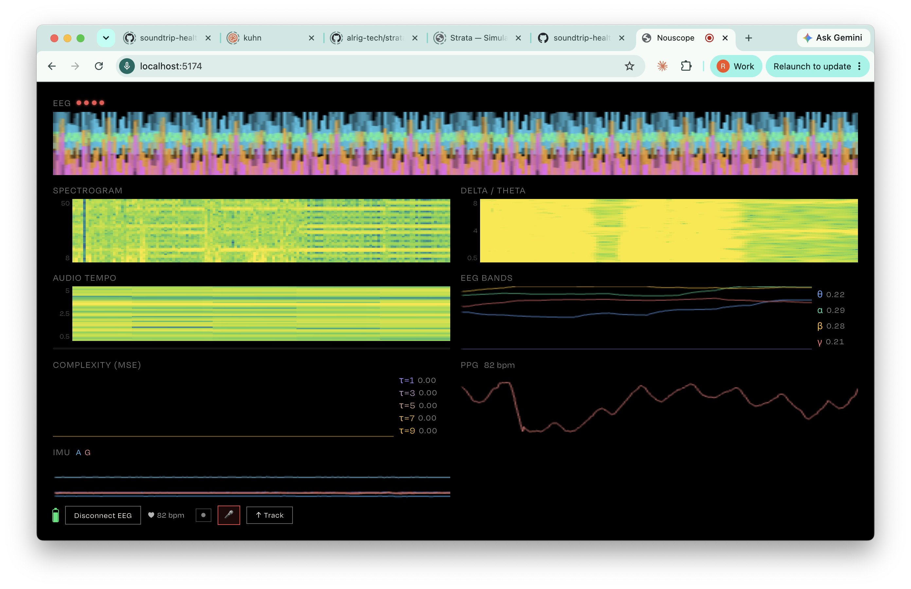

# Nouscope

An audio-reactive 3D particle visualizer with optional Muse EEG/PPG/IMU biometric integration, built with Three.js and WebGL.

[](https://soundtrip.health/nouscope/)

**[Live demo](https://soundtrip.health/nouscope/)**

## Features

- Audio-reactive 3D particle system (Three.js / WebGL)
- Audio BPM beat detection — optional beat-synced rotation tweens and cylinder mesh resets (**Auto Rotate** / **Auto Mix**)
- Five EEG frequency bands (delta, theta, alpha, beta, gamma) mapped to visual parameters
- PPG heart rate detection with per-beat warm color pulse
- IMU head-pose control — tilt your head to rotate the particle field
- Upload audio, add `public/audio/demo.mp3` for a one-click start, or stream from a [Jellyfin](https://jellyfin.org/) server
- dat.GUI controls for colors, audio band gains, per-parameter bio mapping, and IMU strength

## Browser Support

| Feature | Chrome | Edge | Firefox | Safari |
|---------|--------|------|---------|--------|
| Visualizer | ✅ | ✅ | ✅ | ✅ |
| EEG (Web Bluetooth) | ✅ | ✅ | ❌ | ❌ |

**Note:** EEG/Bluetooth features require Chrome or Edge. HTTPS is required for Web Bluetooth in production.

## Getting Started

### Prerequisites

- Node.js 18+
- npm

### Install & Run

```bash
npm install
npm run dev
```

Open `http://localhost:5173` (any modern browser; use Chrome or Edge to develop or test Web Bluetooth / EEG).

### Demo Track

Place a royalty-free MP3 at `public/audio/demo.mp3`. Suggested sources:

- [Freesound.org](https://freesound.org) — filter by CC0
- [Free Music Archive](https://freemusicarchive.org) — filter by CC0

If `demo.mp3` is absent, the app prompts the user to upload a file.

## Usage

1. Click anywhere to start with the demo track (if `public/audio/demo.mp3` exists), use **↑ Track** to upload a file, or **☁ Jellyfin** to pick a track from your server
2. The particle field reacts to audio in real time
3. Optionally click **Connect EEG** to pair a Muse headset via Bluetooth
4. Use the dat.GUI panel (top-right, desktop only) to adjust colors, **AUDIO** gains, **MAPPING** (which biometric drives each visual parameter), and **VISUALIZER** options including **IMU Strength**

## EEG Integration

Requires a [Muse](https://choosemuse.com/) EEG headset (Muse 2 or Muse S) and Chrome or Edge.

| EEG band | Frequency (approx.) | Default in **MAPPING** (changeable per parameter) |
|----------|---------------------|------------------------------------------------------|
| Delta (1–4 Hz) | Deep sleep | Not mapped by default — assign in **MAPPING** if desired |
| Theta (4–8 Hz) | Drowsy / relaxed | Particle size |
| Alpha (8–13 Hz) | Calm / idle | Spread radius (`maxDistance`) |
| Beta (13–30 Hz) | Focused / alert | Turbulence (`offsetGain`) and field chaos (`frequency`) |
| Gamma (30–50 Hz) | High cognition | Amplitude and hue shift |

**PPG / Heart Rate** — detects heartbeats from the Muse's infrared sensor and drives a warm color flush on each beat.

**IMU / Head Pose** — accelerometer pitch and roll map to particle field rotation when **Head Control (IMU)** is enabled in the GUI.

## Customization

Main controls in the dat.GUI panel:

| Folder | Control | Effect |
|--------|---------|--------|
| PARTICLES | Start Color / End Color | Gradient colors across displacement distance |
| VISUALIZER | Auto Mix | On random beats, rebuild a new randomized cylinder mesh |
| VISUALIZER | Auto Rotate | GSAP-driven rotation tweens on beats |
| VISUALIZER | Head Control (IMU) | Route IMU pitch/roll to rotation |
| VISUALIZER | IMU Strength | Scale (0–3) head-tilt → rotation |
| VISUALIZER | Reset Cylinder | Manually reset to cylinder geometry |
| AUDIO | Bass / Mid / High Gain | Per-band audio contribution (0–2) |
| MAPPING | Amplitude, Turbulence, … | Per visual parameter: **Source** (EEG band, `hr`, or none) + **Weight** |

### Shader Uniforms

| Uniform | Driven by (defaults) | Effect |
|---------|------------------------|--------|
| `amplitude` | audio `high` × EEG **gamma** (MAPPING) | particle displacement intensity |
| `offsetGain` | audio `mid` × EEG **beta** (turbulence) | turbulence / z-oscillation |
| `frequency` | GSAP base × EEG **beta** (field chaos) | curl field scale / chaos |
| `size` | base × EEG **theta** | base particle size |
| `maxDistance` | base × EEG **alpha** | displacement falloff radius |
| `hueShift` | EEG **gamma** | HSV hue rotation of palette |
| `heartPulse` | **hr** mapping × PPG phase | warm reddish color flush |

## Developer Guide

For a detailed explanation of the signal processing algorithms, shader math, and biometric → visual parameter mappings, see [`docs/algorithms.md`](docs/algorithms.md).

## Architecture

```
src/js/
├── index.js                  — entry point, instantiates App
├── App.js                    — scene, camera, renderer, managers, render loop
├── managers/
│   ├── AudioManager.js       — audio loading (File or URL), freq band extraction
│   ├── BPMManager.js         — BPM detection, beat event dispatcher
│   ├── EEGManager.js         — Muse BT, EEG bands, PPG heart rate, IMU head pose
│   └── JellyfinManager.js    — Jellyfin auth, browse, stream URLs
├── ui/
│   ├── BioDataDisplay.js     — live EEG / PPG / IMU / spectrogram panel
│   └── JellyfinBrowser.js    — modal library browser
└── entities/
    ├── ReactiveParticles.js  — ShaderMaterial, GSAP tweens, audio/EEG mapping
    └── glsl/
        ├── vertex.glsl       — simplex noise curl field, particle displacement
        └── fragment.glsl     — circular point shape, distance color gradient, heartPulse
```

### Audio → Visual Pipeline

Each frame (`App.update()`): `EEGManager.update()` (heart phase, etc.) → `ReactiveParticles.update()` (maps latest audio + EEG to uniforms; reads `AudioManager.frequencyData` from the **previous** frame’s `AudioManager.update()`) → `AudioManager.update()` refreshes FFT bands for the **next** frame → render.

On each BPM beat, `onBPMBeat()` randomly (30% each) triggers cylinder resets (`resetMesh()` → `createCylinderMesh()`) and/or rotation tweens when the corresponding **VISUALIZER** toggles are on.

## Credits

- Original particle visualizer concept and tutorial: [Tiago Canzian](https://github.com/tgcnzn/Interactive-Particles-Music-Visualizer)
- EEG/PPG/IMU integration: [Soundtrip](https://github.com/soundtrip-health)
- [muse-js](https://github.com/soundtrip-health/muse-js) — Web Bluetooth Muse SDK
- [web-audio-beat-detector](https://github.com/chrisguttandin/web-audio-beat-detector) — BPM detection
- [Three.js](https://threejs.org) — 3D rendering
- [GSAP](https://greensock.com/gsap/) — animation
- Simplex noise: [Ian McEwan / Ashima Arts](https://github.com/ashima/webgl-noise)

## License

MIT — see [LICENSE](LICENSE)
